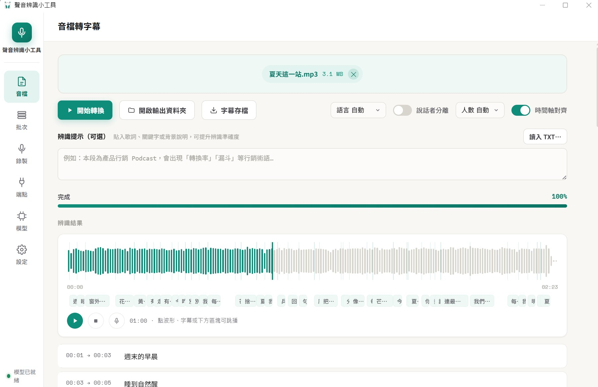
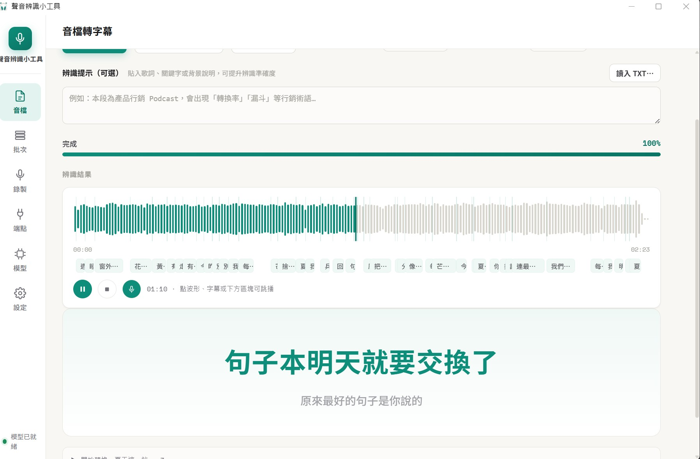
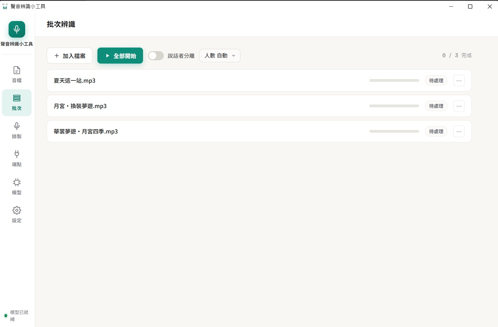
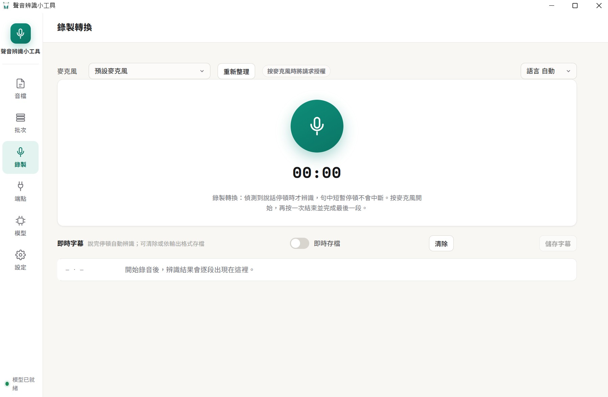
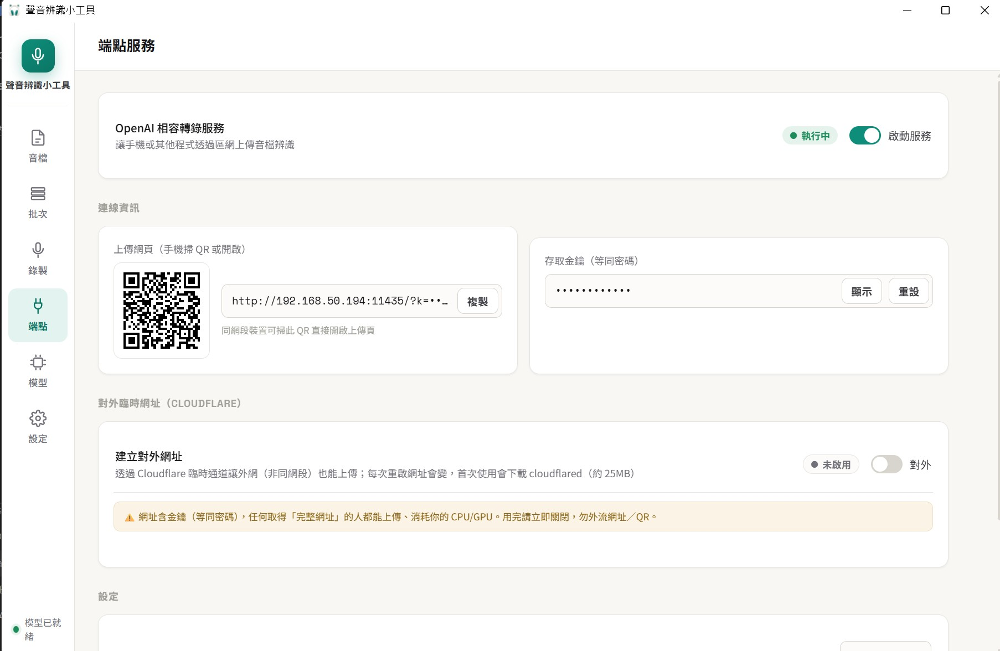
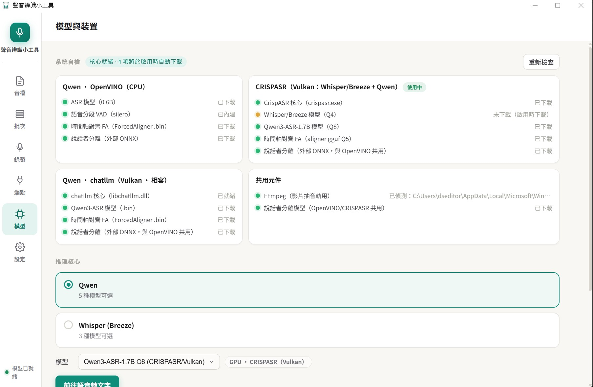
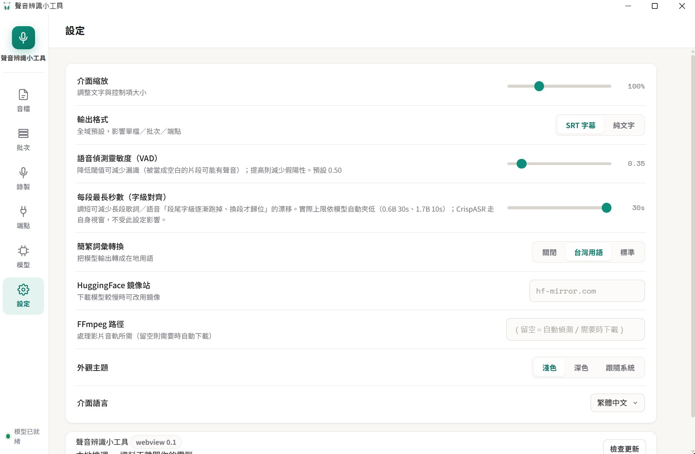

# 聲音辨識小工具（QwenASR WebView 版）

本地語音辨識字幕生成工具 —— **資料不離開你的電腦**。以 Qwen3-ASR / Whisper(Breeze-ASR-26) 為核心，
音檔、影片、麥克風錄音都能轉成 SRT 字幕。全新 **WebView 介面**（淺色 teal 風格、原生 WebView2 視窗），
支援純 CPU（OpenVINO INT8）與 GPU 加速（CrispASR / Vulkan，NVIDIA・AMD・Intel 通吃）。

> 目標很單純：讓你的同事、你的同學、你的阿嬤，都能免費、離線、在自己的電腦上做語音辨識。

- 介面標題：**聲音辨識小工具**（貓耳耳機圖示）
- 版本線：`webview 0.2`（與舊版 CustomTkinter 桌面版 `1.0.9` 分流並存，兩者互不干擾）
- 舊版桌面版（CustomTkinter）說明文件已移至 [`oldreadme.md`](oldreadme.md)

---

## 主要特色

- 🎧 **音檔 / 影片 → SRT 字幕**：MP3・WAV・FLAC・M4A・OGG 等音訊，及 MP4・MKV・MOV 等影片（自動用 ffmpeg 抽音軌）
- 🎙️ **麥克風錄製轉換**：偵測說話停頓自動分段辨識（非逐字串流），可即時存檔
- 🌊 **真實波形 + 播放頭 + 分段標註**：Suno 式波形，點波形／字幕／區塊即可跳播
- 🎤 **卡拉OK逐字模式**：字級時間軸貫通，播放時逐字高亮歌詞（見下方截圖）
- 🌏 **多語系辨識**：中文、日文、英文等 30 種語系，可自動偵測或鎖定語言
- 🇯🇵 **日語強化（新）**：內建 **Qwen3-ASR-1.7B 日語動漫**特化模型，日文歌詞／台詞辨識明顯較佳；日語輸出保留原生漢字（不誤繁化）
- 👥 **說話者分離**：可指定人數，SRT 自動標記「說話者1／2…」
- 💬 **辨識提示（參考文字）**：貼入歌詞、關鍵字或背景說明，提升辨識準確度
- 📚 **批次辨識**：一次匯入大量音訊／影片，依序自動辨識
- 🔌 **端點服務**：內建 OpenAI 相容轉錄 API + 手機掃碼上傳頁 + Cloudflare 對外通道
- 🧩 **多推理核心**：CrispASR（Vulkan GPU）／OpenVINO（純 CPU）／chatllm（向下相容），可於「模型」頁切換
- 🎨 **深淺色主題 + 介面縮放 + 多語介面**（繁中／简体／English）
- 📦 **開箱即用**：CrispASR 核心與 VAD 隨包附帶；各模型／ffmpeg 按需自動下載

---

## 介面導覽

### 音檔轉字幕



主畫面。拖入或選擇音檔（影片亦可）後：

1. 上方可設定 **語言**（預設自動）、**說話者分離**（可選人數）、**時間軸對齊**（字級時間軸）
2. 可在「**辨識提示**」貼入歌詞／關鍵字，或「讀入 TXT」載入參考文字
3. 點「**▶ 開始轉換**」，進度列即時顯示；完成後可「**開啟輸出資料夾**」或「**字幕存檔**」
4. 下方呈現**真實波形 + 播放頭 + 分段標註**，點波形、字幕條或區塊都能跳播

### 卡拉OK逐字播放



啟用時間軸對齊後，播放時字幕會以**大字逐字高亮**呈現（卡拉OK效果），下一句以淡色預覽，
適合對歌詞、做字幕校對或教學展示。

---

### 批次辨識



切到「**批次**」分頁，「**+ 加入檔案**」可多選音訊／影片，「**▶ 全部開始**」依序辨識，
每列即時顯示進度與狀態（待處理／辨識中／完成／失敗），完成後可由「**⋯**」開啟字幕編輯。
批次過程中可隨時再加檔案。適合整批會議錄音、多集 Podcast、課堂錄影一次轉字幕。

---

### 錄製轉換



切到「**錄製**」分頁，選擇麥克風後按下中央麥克風鈕開始。**系統在偵測到說話停頓時才辨識**
（句中短暫停頓不會中斷），結果逐段出現在下方「即時字幕」。可開「**即時存檔**」邊錄邊存，
或錄完按「**儲存字幕**」。再按一次麥克風鈕結束並完成最後一段。

---

### 端點服務（內網／手機上傳）



切到「**端點**」分頁，開啟「**OpenAI 相容轉錄服務**」後：

- **手機掃碼上傳**：同網段裝置掃 QR 或開啟網址，直接上傳音訊／影片辨識
- **OpenAI 相容 API**：`POST /v1/audio/transcriptions`，可被腳本、OpenWebUI 等串接
- **存取金鑰（等同密碼）**：可顯示／重設，保護你的算力
- **對外臨時網址（Cloudflare）**：一鍵開臨時通道讓非同網段也能上傳（首次會下載 cloudflared 約 25MB）

> ⚠️ 對外網址內含金鑰，任何取得完整網址的人都能上傳、消耗你的 CPU/GPU。用完請立即關閉。

---

### 模型與裝置



切到「**模型**」分頁：

- **系統自檢**：逐核心 × 逐能力列出檔案就緒狀況（綠＝已備、黃＝啟用時自動下載）
- **推理核心**：可選 **Qwen** 或 **Whisper (Breeze)**；下方「模型」下拉依核心動態切換
- **切換即重啟**：切核心／模型會持久化設定並提示重新啟動（避免就地切換 Vulkan context 造成當機）

四張核心卡片：**Qwen · OpenVINO（CPU）**、**CRISPASR（Vulkan：Whisper/Breeze + Qwen）**、
**Qwen · chatllm（Vulkan · 相容）**、**共用元件（FFmpeg／說話者分離）**。

---

### 設定



切到「**設定**」分頁，集中管理偏好：

| 設定項 | 說明 |
|--------|------|
| **介面縮放** | 調整文字與控制項大小 |
| **輸出格式** | 全域預設 SRT 字幕／純文字（影響單檔・批次・端點）|
| **語音偵測靈敏度（VAD）** | 降低閾值減少漏識、提高減少假陽性（預設 0.50）|
| **每段最長秒數（字級對齊）** | 調短可減少長段歌詞的「段尾字漸漸跑掉」漂移；依模型自動夾低（0.6B 30s／1.7B 10s）。CrispASR 走自身視窗不受此設定影響 |
| **簡繁詞彙轉換** | 關閉／台灣用語（s2twp）／標準（s2t）|
| **HuggingFace 鏡像站** | 下載較慢時可改用鏡像（如 hf-mirror.com）|
| **FFmpeg 路徑** | 處理影片音軌用；留空＝自動偵測／需要時下載 |
| **外觀主題** | 淺色／深色／跟隨系統（視窗標題列同步）|
| **介面語言** | 繁體中文／简体中文／English |

底部顯示版本徽章與「檢查更新」（WebView 版檢查更新只開啟發行頁）。

---

## 推理核心與模型

本工具「模型驅動核心」—— 在「模型」頁選哪顆模型，就自動用對應的推理後端。

### CRISPASR（Vulkan GPU）— 主力核心

以 [CrispASR](https://github.com/CrispStrobe/CrispASR)（whisper.cpp 家族的多後端 runtime，ggml C++）
走 **Vulkan** 加速，Windows 上通吃 NVIDIA／AMD／Intel，無須安裝 CUDA／ROCm。本版隨包 **CrispASR v0.8.8** 核心。

| 模型 | 用途 |
|------|------|
| **Qwen3-ASR-1.7B Q4 / Q8** | 通用高辨識率，繁中斷句佳 |
| **Qwen3-ASR-1.7B 日語動漫 Q4 / Q8**（新）| 日語／動漫特化，日文歌詞・台詞辨識明顯較佳 |
| **Whisper Breeze-ASR-26 Q4 / Q5 / Q8** | 繁中／台語特化（large-v2 等級）|
| **qwen3 ForcedAligner GGUF** | 字級時間軸對齊（卡拉OK逐字、精準字幕）|

### Qwen · OpenVINO（純 CPU）

免顯卡、免驅動，純 CPU 即可執行。**0.6B**（輕量，開箱即用）與 **1.7B INT8 KV-Cache**（更準，按需下載）。
適合沒有獨顯的環境。

### Qwen · chatllm（Vulkan · 向下相容）

保留供既有使用者向下相容（曾用過 chatllm 或自桌面版沿用者）。核心二進位**不隨安裝包附帶**，
只有機器上實際備有 `libchatllm.dll` 時才會在清單中現身。

---

## 日語辨識強化（webview 0.2 新增）

新增 **Qwen3-ASR-1.7B 日語動漫**特化模型（[cstr/qwen3-asr-1.7b-ja-anime-GGUF](https://huggingface.co/cstr/qwen3-asr-1.7b-ja-anime-GGUF)），
針對日語／動漫語音微調，日文歌詞、台詞辨識明顯優於標準模型。實測日文歌曲對比：

| 標準 Qwen3-ASR-1.7B | 日語動漫版 |
|---------------------|-----------|
| An なまぶしさ（英日混雜）| **あんな眩しさ**（正確漢字）|
| 輪切りかけたコヨーテ（胡言）| **わかりかけた**（較合理）|
| どこ。（截斷）| **どこかで会えるように**（完整）|

同時修正：**語言選日語時跳過 OpenCC 繁化**（原本會把日文漢字 会／静／図 誤轉成繁中字形 會／靜／圖），
保留日文原生字形；中文／台語辨識維持繁化不變。

---

## 安裝與更新

### 免安裝 EXE（推薦）

至 [GitHub Releases](https://github.com/dseditor/QwenASRMiniTool/releases) 下載 **QwenASR-WebView** 版壓縮包，
解壓後執行 `QwenASR-WebView.exe`。首次啟動：

- 已內含 CrispASR 核心與 VAD，選定模型後若尚未下載會提示，按「下載並載入」即自動下載
- 影片辨識首次會提示下載 ffmpeg；說話者分離、字級對齊模型皆按需下載

> 💡 若解壓後 Windows 阻擋執行，於 exe 按右鍵 →「內容」→ 勾選「解除封鎖」即可（Mark-of-the-Web）。

### 原始碼執行 / 自行編譯

```bash
git clone https://github.com/dseditor/QwenASRMiniTool.git
cd QwenASRMiniTool
# 建立虛擬環境並安裝需求後：
python app_webview.py          # 啟動 WebView 介面
# 或編譯為單一 EXE：
build_webview.bat              # 產出 dist2\QwenASR-WebView\QwenASR-WebView.exe
```

---

## Ubuntu Source Install

Ubuntu 24.04 x86-64 is supported as a source install.  The full install guide
and manual checklist are in the `docs/` folder:

- **[docs/ubuntu.md](docs/ubuntu.md)** — step-by-step install guide: apt
  prerequisites, uv, `uv sync`, first launch, model download, FFmpeg, optional
  cloudflared, quitting, and a troubleshooting table keyed by capability code.
- **[docs/ubuntu-clean-vm-checklist.md](docs/ubuntu-clean-vm-checklist.md)** —
  the committed clean-VM manual walk: apt + uv, `uv sync`, first launch with no
  models, 0.6B download, audio transcription, video conversion, microphone
  recording, endpoint exposure + second-machine call, quit, and orphan process
  check (`pgrep ffmpeg && pgrep cloudflared`).

Quick start:

```bash
sudo apt install -y ca-certificates ffmpeg xdg-utils python3-tk
curl -LsSf https://astral.sh/uv/install.sh | sh && source "$HOME/.local/bin/env"
git clone https://github.com/paulpengtw/QwenASRMiniTool.git && cd QwenASRMiniTool
uv sync && ./run.sh
```

---

## 系統需求

| 項目 | CPU 模式（OpenVINO）| GPU 模式（CrispASR / Vulkan）|
|------|--------------------|------------------------------|
| 作業系統 | Windows 10 / 11（64-bit）| Windows 10 / 11（64-bit）|
| RAM | 6 GB（峰值約 4.8 GB）| 8 GB 以上 |
| 硬碟 | 2 GB（0.6B 約 1.2 GB）| 依模型：Qwen 1.7B GGUF Q8 約 2.5 GB |
| GPU | 不需要 | Vulkan 1.2+（NVIDIA / AMD / Intel）|
| WebView2 | Windows 11 內建；Windows 10 需安裝 Edge WebView2 Runtime | 同左 |

> ⚠️ 安裝路徑請使用**全英文**（例如 `C:\QwenASR`），含中文字元可能無法正常執行。

---

## 模型來源

| 項目 | 連結 |
|------|------|
| Qwen3-ASR-1.7B GGUF（CrispASR/Vulkan）| [cstr/qwen3-asr-1.7b-GGUF](https://huggingface.co/cstr/qwen3-asr-1.7b-GGUF) |
| **Qwen3-ASR-1.7B 日語動漫 GGUF**（新）| [cstr/qwen3-asr-1.7b-ja-anime-GGUF](https://huggingface.co/cstr/qwen3-asr-1.7b-ja-anime-GGUF) |
| Whisper Breeze-ASR-26 GGML | [phate334/Breeze-ASR-26-GGML](https://huggingface.co/phate334/Breeze-ASR-26-GGML) |
| qwen3 ForcedAligner GGUF | [cstr/qwen3-forced-aligner-0.6b-GGUF](https://huggingface.co/cstr/qwen3-forced-aligner-0.6b-GGUF) |
| 0.6B OpenVINO INT8（主／備）| [dseditor](https://huggingface.co/dseditor/Qwen3-ASR-0.6B-INT8_ASYM-OpenVINO) ／ [Echo9Zulu](https://huggingface.co/Echo9Zulu/Qwen3-ASR-0.6B-INT8_ASYM-OpenVINO) |
| 1.7B OpenVINO INT8 KV-Cache | [dseditor/Qwen3-ASR-1.7B-INT8_OpenVINO](https://huggingface.co/dseditor/Qwen3-ASR-1.7B-INT8_OpenVINO) |
| 原始 PyTorch 模型 | [Qwen/Qwen3-ASR-0.6B](https://huggingface.co/Qwen/Qwen3-ASR-0.6B) ／ [1.7B](https://huggingface.co/Qwen/Qwen3-ASR-1.7B) |
| VAD 模型 | [snakers4/silero-vad v4.0](https://github.com/snakers4/silero-vad) |
| 說話者分離模型 | [altunenes/speaker-diarization-community-1-onnx](https://huggingface.co/altunenes/speaker-diarization-community-1-onnx) |

---

## 開發者說明

### 架構（WebView 版）

```
app_webview.py          # WebView 版進入點（原生 WebView2 視窗 + 本機 HTTP server）
webview_server.py       # 本機 stdlib HTTP 伺服器（serve webview/ + /api，含 Host 白名單防 rebinding）
webview_backend.py      # WebView 共用後端邏輯（核心/模型目錄、載入、自檢、端點）
webview/                # 前端（HTML / CSS / JS，i18n），python·端點·EXE 三版共用
  index.html  css/app.css  js/{app,bridge,i18n}.js
app.py                  # 引擎核心 ASREngine（OpenVINO）+ 既有桌面版共用邏輯
crisp_engine.py         # CrispASR（Vulkan）推理引擎：Whisper/Breeze + Qwen3-ASR GGUF 子程序包裝
chatllm_engine.py       # chatllm（Vulkan）推理引擎（向下相容）
subtitle_lines.py       # 全引擎共用字幕分行（字級時間軸→字幕行，標點/空白切 + 孤兒合併）
fa_aligner.py           # ForcedAligner 字級時間軸（OpenVINO/chatllm 共用）
subtitle_editor.py      # 字幕驗證與編輯
batch_tab.py            # 批次排程邏輯
diarize.py              # 說話者分離引擎（外部 ONNX，兩階段聚類，不依賴 torch）
audio_io.py             # 音訊讀取（16k mono，不依賴 librosa）
processor_numpy.py      # 純 numpy Mel / BPE 處理器
api_server.py           # OpenAI 相容轉錄端點（純標準庫）
cf_tunnel.py            # Cloudflare 臨時通道
downloader.py           # 模型完整性檢查與按需下載（含 LFS pointer 偵測、HF 鏡像）
version.py / updater.py # 版本單一事實來源 / 自動更新
build_webview.bat       # PyInstaller onefile 打包（WebView EXE）
crispasr/               # CrispASR 核心（exe + dll，隨包）；模型 *.bin/*.gguf 按需下載
ov_models/              # OpenVINO 模型 / VAD / Qwen GGUF / 說話者分離 ONNX
```

### 為什麼是 WebView + onefile

- **WebView**：改用本機 stdlib HTTP server + 原生 WebView2 視窗（棄 pywebview 的 pythonnet 遞迴 bug），前端純網頁、跨三版共用。
- **onefile**：onedir 的散落 DLL 在解壓時會沾上 Mark-of-the-Web，.NET 拒載 → 退回 Edge。onefile 執行時解壓 DLL 到暫存（無 MOTW），使用者只需解封鎖一個 exe。

### 第三方致謝

- **[CrispASR](https://github.com/CrispStrobe/CrispASR)**（CrispStrobe）— Vulkan 多後端 ASR runtime（whisper / qwen3），本專案使用其官方 Windows 預編譯版。
- **[chatllm.cpp](https://github.com/foldl/chatllm.cpp)**（foldl，MIT）— Vulkan GPU 推理後端（向下相容），使用官方預編譯二進位。
- **[Breeze-ASR-26](https://huggingface.co/phate334/Breeze-ASR-26-GGML)**（phate334）— 繁中／台語特化 Whisper 模型。
- **[FFmpeg](https://ffmpeg.org/)**（GPL）— 影片音軌提取，按需下載，二進位不內嵌。
- **[silero-vad](https://github.com/snakers4/silero-vad)** — 語音活動偵測。

---

## 授權

本專案程式碼以 **MIT** 授權釋出。模型權重與第三方預編譯二進位依各自來源的授權條款。
